# AgentPact

> Governed Browser-Agent Harness, Domain Pack SDK & Conformance Kit

AgentPact 是一个面向高风险浏览器任务的 Agentic RPA 执行与恢复框架。它关注的不只是 Agent 能否完成任务，还包括：Agent 是否有权执行、外部副作用是否经过确定性授权、结果不确定时能否安全停止，以及如何通过独立证据确认真实业务状态。

项目基于 [Skyvern](https://github.com/Skyvern-AI/skyvern) 的浏览器 Agent Loop 构建，在模型决策与 Playwright 副作用之间加入类型化领域契约、确定性授权、一次性执行许可、持久化尝试状态和分级恢复机制。当前实现仅面向 `synthetic.payment` 合成场景，不是生产系统。

## 为什么需要 AgentPact

传统浏览器自动化常把“点击成功”视为任务成功，但真实业务操作还必须回答：

- 自然语言目标是否对应当前用户已获授权的业务能力？
- 模型提出的计划是否超出 Capability、租户、数据范围或有效 Grant？
- 页面动作是否仍符合原始业务意图和最新页面证据？
- 提交后连接超时，操作究竟失败了，还是已经产生外部副作用？
- 恢复是在继续任务，还是会制造重复付款、重复订单或重复审批？

AgentPact 将这些问题放进浏览器执行主链的边界设计中。浏览器传输成功不等于业务成功；当结果无法确认时，系统进入 `UNKNOWN`，禁止重放，并且只能通过独立 Result Probe 重新观察目标系统。

> Agent 不应该在“不知道有没有成功”时再次点击提交。

## 架构

```mermaid
flowchart LR
    U[自然语言任务] --> I[身份、租户与可信业务上下文]
    I --> C[Capability / Domain Pack]
    C --> P[受约束 Planner / BusinessPlan]
    P --> W[ExecutionWorkOrder]
    W --> S[Skyvern Agent Loop]
    S --> G[Governance Kernel]
    G -->|ExecutionPermit| A[ActionHandler / Playwright]
    A --> R[Independent Result Probe]
    R --> D[确认、恢复或人工介入]
```



核心执行链为：

`Capability -> BusinessPlan -> ExecutionWorkOrder -> Action`

- **Domain Pack** 定义业务能力、输入槽、状态转换、风险、证据和 Result Probe，不直接操作 DOM 或 Playwright。
- **Planner** 只能在可信代码投影出的 Capability 和结构化约束内提出计划，不能创建身份、租户、Grant、策略、Permit、浏览器动作或业务值。
- **BusinessPlan** 表达受授权的业务步骤；可信编译器将其转换为顺序执行的 `ExecutionWorkOrder`。
- **ExecutionWorkOrder** 固定允许/禁止操作、成功标准、证据要求、恢复上限和原生 Task/Step 身份。
- **Skyvern Agent Loop** 负责 DOM、截图、页面内动作选择和浏览器级恢复；`ActionHandler` 是浏览器副作用的唯一执行入口。
- **Governance Kernel** 在副作用发生前完成策略、审批、最新观察、`ExecutionPermit` 和 `ExecutionAttempt` 裁决。
- **Result Probe** 独立确认最终业务结果。`UNKNOWN` 状态禁止动作重放和 Replan，直到精确关联的 Probe 给出权威结果。

## 核心设计

### Domain Pack SDK 与 Conformance Kit

Domain Pack SDK 使用版本化、类型化契约描述 Agent 可调用能力、业务事实、效果分类、状态机、证据要求和 Result Probe。离线 Contract Catalog 与活动运行时注册严格隔离；运行时代码不能把离线 SDK 清单当作动态执行入口。

Conformance Kit 使用确定性检查验证 Pack 来源、所有者、版本、Capability、证据和安全语义。当前只有 `synthetic.payment` 参考 Pack 通过这条边界。

### 模型安全的受约束 Planner

M9 将模型限制为 proposal-only 边界：

- 真实业务值始终留在可信代码中；模型只能看到 Capability、输入槽元数据、步骤角色和脱敏证据 token。
- 身份、租户、Grant、Contract、Policy、Permit、Attempt、审批、浏览器字段、选择器和凭据不得进入模型输入或输出。
- 禁止权限/浏览器字段和语义越权是终止性拒绝，不能通过 repair 修复。
- 只有有限的结构错误允许一次 repair；可信编译器随后重新绑定真实业务输入与权威身份。
- 确定性评估边界覆盖接受、终止拒绝、单次结构修复、值泄漏和保留字段别名等行为。

### 确定性执行闸门

具有外部副作用的 Action 必须经过策略判断、必要审批、基于最新页面观察签发的一次性 `ExecutionPermit`，并先持久化 `ExecutionAttempt`，才能交给 `ActionHandler`。Locator、坐标、JavaScript、CUA 和缓存动作等 fallback 同样受治理，不能成为绕过授权的替代路径。

审批恢复不会复用旧动作或旧观察。审批通过后必须重新观察页面、重新评估策略并签发新的 Permit，才能产生副作用。

### 持久 Journal、UNKNOWN 与有界 Replan

多步骤 Agent Loop 按顺序执行 BusinessPlan，并将计划状态写入哈希链 Journal。已完成前缀不可变；业务状态不匹配时，只允许在预算内重编译未完成后缀。

如果副作用可能已经发生但结果无法确认，Attempt 进入 `UNKNOWN`：

- 禁止使用相同幂等键或相同权限重放动作；
- 禁止在不确定结果上继续 Replan；
- 只能由精确关联 Task、Step、Permit、Attempt、binding 和 probe reference 的独立 Probe 解决；
- Journal 恢复会补齐已由权威证据证明、但因崩溃窗口尚未写入的状态，同时拒绝冲突或无关分支。

### Governed Agent Run API 与操作入口

M10 提供受治理的 Agent Run API 和操作员入口。创建请求经过同一套 Planner、可信编译、Admission、审批、最新观察、Permit、Attempt、原生 Agent 执行与 Probe 路径。公开投影只返回安全的 Pack 元数据、计划摘要、状态、原因码和服务器声明的 `legal_actions`。

操作员只能执行权威详情投影当前允许的 `approve`、`reject`、`cancel` 或 `probe`。列表或前端状态不能自行推断命令权限。

### M11 Provider 组合与操作工作台

M11 将 M10 入口扩展为可恢复的操作工作台：

- Provider 模式只能由服务器配置为 `recorded` 或 `live`；默认为无需凭据的确定性 `recorded`。
- `live` 复用 OpenAI-compatible endpoint、model 和环境凭据配置。配置不完整时启动失败，不会静默回退到 `recorded`。
- Provider 调用在有界的非事件循环线程中执行；模型输出仍必须通过不变的 M9 终止优先校验和可信编译边界。
- 初次创建使用由认证 `tenant_id + request_id` 派生的 PostgreSQL session advisory lock。锁覆盖重新读取、Provider/校验、Admission、审批暂停持久化和权威读回，序列化相同请求 ID 的重复或冲突创建。
- Admission 只持久化安全的 `recorded|live` provenance，不保存 endpoint、model、凭据、prompt、response 或 Provider trace。旧 M10 Admission 默认解释为 `recorded`。
- 租户隔离的历史接口使用稳定游标返回脱敏摘要，不包含 `legal_actions`；跨租户记录与不存在记录不可区分。
- React 工作台用 `?run=<id>` 恢复所选 Run，只轮询当前可见且未终止的详情，并只渲染 root-locked 权威详情返回的 `legal_actions`。

## 当前能力

| 里程碑 | 状态 | 已交付能力 |
|---|---|---|
| M1 契约边界 | 已完成 | 不可变离线 Contract Catalog；未安装 Pack 默认不可执行 |
| M2 Pack SDK | 已完成 | 类型化契约、效果、证据、版本规则与确定性 Conformance Kit |
| M3 参考 Pack | 已完成 | `synthetic.payment` 参考实现和有效/无效 Conformance 夹具 |
| M4 治理 E2E | 已完成 | Chromium 副作用、持久化 Attempt、`UNKNOWN`、禁止重放与独立 Probe |
| M5 开发者体验 | 已完成 | 跨平台 CLI、版本锁定、机器可读报告和发布前检查入口 |
| M6 受约束 Runtime | 已完成 | 安装、身份、租户/RBAC、CapabilityGrant 投影和可信编译 |
| M7 原生 Agent 闭环 | 已完成 | ForgeAgent/Chromium、原生 Task/Step、Permit/Attempt 和 Probe 关联 |
| M8 顺序 Agent Loop | 已完成 | 多步骤计划、不可变完成前缀、有界后缀 Replan 和持久 Journal |
| M9 模型安全 Planner | 已完成 | 值隔离、终止优先拒绝、单次结构修复和确定性评估边界 |
| M10 Agent Run API | 已完成 | 受治理创建、审批/取消/Probe 命令、安全投影和操作员入口 |
| M11 操作工作台 | 已完成 | recorded/live 服务器组合、advisory-lock 幂等、持久 provenance、租户历史和 URL 恢复 |

## 演进方向

以下内容是后续工程方向，不表示当前已经实现或具备生产可用性：

- 将合成参考 Runtime 的接口与生命周期进一步抽象，同时保持 Governance Kernel 位于所有浏览器副作用之前。
- 补齐真实 Domain Pack 安装、升级、失效、连接器和权威业务数据源接入流程。
- 完善审计保留、密钥管理、模型地域、容量、可观测性、灾难恢复和受控 rollout 策略。
- 在真实领域采用者提供业务事实、权限来源和独立结果探针之前，继续 fail closed。

长期目标不是让模型获得无限执行权，而是在可验证的领域契约内实现受约束自治。

## 安装与运行合成验证

支持 Python 3.11、3.12 和 3.13。PostgreSQL 14+ 需要在 `PATH` 中提供 `initdb`、`pg_ctl`、`createdb` 和 `pg_isready`。以下命令均在仓库根目录执行，并使用虚拟环境中的 Python；统一入口为 `scripts/finrpa_release.py`。

### Windows PowerShell

```powershell
py -3.11 -m venv .venv
$VenvPython = (Resolve-Path .venv\Scripts\python.exe).Path
& $VenvPython -m pip install -e . -r requirements-m5-demo.lock
& $VenvPython -m playwright install chromium
& $VenvPython scripts\finrpa_release.py doctor
& $VenvPython scripts\finrpa_release.py conformance
& $VenvPython scripts\finrpa_release.py demo
& $VenvPython scripts\finrpa_release.py report
```

### Linux/WSL

```bash
python3.11 -m venv .venv
VENV_PYTHON="$(pwd)/.venv/bin/python"
"$VENV_PYTHON" -m pip install -e . -r requirements-m5-demo.lock
"$VENV_PYTHON" -m playwright install chromium
"$VENV_PYTHON" scripts/finrpa_release.py doctor
"$VENV_PYTHON" scripts/finrpa_release.py conformance
"$VENV_PYTHON" scripts/finrpa_release.py demo
"$VENV_PYTHON" scripts/finrpa_release.py report
```

macOS 仅提供尽力支持，不作为发布门禁。自动发现不可用时，可将 `FINRPA_POSTGRES_BIN` 指向 PostgreSQL 二进制目录，或将 `FINRPA_CHROMIUM_EXECUTABLE` 指向已安装的 Chromium 可执行文件。这些配置项只接受可执行路径，不用于传递凭据。

命令成功时返回 `0`；缺少前置条件、条件不安全或证据无效时返回 `2`；`conformance` 或 `demo` 检查失败时返回 `3`。生成的 `finrpa.release-report/v1` JSON/Markdown 证据写入已忽略的 `artifacts/m5/` 目录。

### 可选 live Provider 配置

CI 和默认本地验证始终使用确定性的 `recorded` 模式，不调用外部模型。只有显式配置完整的服务器环境时才启用 `live`：

```powershell
$env:AGENT_RUN_PROVIDER_MODE = "live"
$env:OPENAI_COMPATIBLE_API_BASE = "https://provider.example/v1"
$env:OPENAI_COMPATIBLE_MODEL_NAME = "model-name"
$env:OPENAI_COMPATIBLE_API_KEY = "<environment-secret>"
```

不要把真实凭据提交到仓库。浏览器/API 请求不能选择 Provider、endpoint、model、凭据或 fallback 行为。

## 合成验证证明什么

合成验证通过 PostgreSQL、真实 Chromium、回环业务控制台和故障注入证明：系统会在浏览器外部效果前持久化 Attempt；无法确认的传输结果进入 `UNKNOWN`；相同动作不会重放；只有独立 Probe 可以确认结果；受治理流程只产生一次预期副作用。

这证明的是参考边界和恢复语义，而不是生产业务正确性、真实连接器可用性或生产容量。

## 边界与限制

- 当前只有 `synthetic.payment` 合成 Domain Pack，没有生产 Pack、真实支付连接器或生产业务数据。
- `live` Provider 是可选服务器配置；CI、Conformance 和发布基线保持确定性的 `recorded` 模式，不依赖外部网络。
- 不包含生产凭据管理、租户安装、迁移、生产 rollout、全局 enforce 或可运营金融系统能力。
- 浏览器传输成功不会被直接视为业务结果确认；`UNKNOWN` 必须通过独立 Probe 解决。
- 本仓库是开发参考实现和证据验证工具，尚未达到生产就绪状态。

更详细的复现步骤、限制和上游声明请参阅 [M5 开发者指南](docs/phase-2/m5-developer-release-guide.md)、[产品章程](docs/phase-2/final-product-charter.md) 和 [NOTICE](NOTICE.md)。公开仓库地址为 [meizhouyu666/agentpact](https://github.com/meizhouyu666/agentpact)。

## 许可证与声明

本仓库采用 [MIT License](LICENSE)，并基于 [Skyvern](https://github.com/Skyvern-AI/skyvern) 构建。上游版权、许可和归属信息详见 [NOTICE](NOTICE.md)。
