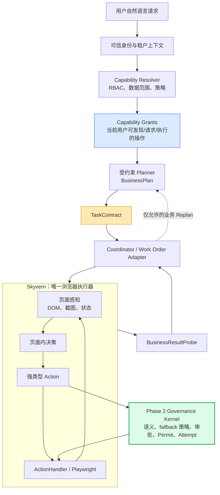

# FinRPA Phase 2 下一阶段 Proposal：受控编排与韧性受治理执行

> 状态：**设计已确认，待实施批准**  
> 范围：在既有 Phase 2 Action Governance Bridge 基础上继续收敛；本提案不授权开启真实 `enforce`，也不包含业务代码实现。

## 1. 背景与结论

当前项目已经完成了 Phase 2 的治理底座：`TaskContract`、`ActionIntent`、`PolicyDecision`、`ExecutionPermit`、`ExecutionAttempt`、`PendingAction`、审批持久化、审批后重新感知恢复、以及 `audit` 模式的 Action 候选记录。

Skyvern 仍是唯一浏览器执行器：它负责页面感知、页面内决策、Playwright 操作和页面级重试。`enterprise/agent` 中的 Planner / Executor / Coordinator 目前是未接入主链的原型，不能作为第二套浏览器执行循环。

下一阶段的明确推荐是：

```text
让 LLM 在“平台已定义且当前用户获授权”的业务能力范围内规划；
让 Skyvern 在受约束的 Work Order 内处理页面操作与页面级恢复；
让 Phase 2 治理内核对高风险 Action、fallback、审批、UNKNOWN 和审计证据做不可绕过的裁决。
```

这不是将 RPA 改造成固定脚本平台，也不是将企业权限交给自由 Agent 判断，而是建立一个**受约束自治**的 Agent-native RPA 控制面。

## 2. 目标与非目标

### 2.1 目标

1. 将“用户自然语言 -> 业务计划”限制在已注册、已授权的业务能力集合内。
2. 用 `BusinessPlan` 和 `ExecutionWorkOrder` 分隔业务编排与 Skyvern 页面执行。
3. 将执行失败路由为 L0--L4，避免把浏览器技术问题误升级为业务 Replan，或把业务 UNKNOWN 当作普通重试。
4. 将 DOM、截图、元素映射、页面版本和 Action 结果统一为可审计的语义感知证据。
5. 将 Skyvern 的 locator、label、坐标、JavaScript、CUA 等 fallback 纳入风险策略、permit 和审计。
6. 建立没有真实金融业务也能运行的 synthetic / demo 评测、回放和故障注入基线。
7. 用一个最小真实领域包验证真实 enforce，而不是先假设通用金融语义。

### 2.2 非目标

- 不新建第二个浏览器 Agent，不让 Coordinator、Planner 或领域包直接操作 DOM、Locator 或 Playwright。
- 不让 LLM 自由发明未注册的业务操作、金额规则、审批规则或结果确认逻辑。
- 不在没有 canonical 业务事实和结果探测器的情况下开启付款、提交、删除、审批等真实 enforce。
- 不把视觉感知当作高风险业务事实的唯一来源。
- 不替换 Skyvern 现有的页面内等待、重抓、重试与基础设施恢复机制；本阶段只定义其可使用的边界。

## 3. 现有资产与当前缺口

### 3.1 可直接复用的资产

| 资产 | 当前能力 | 下一阶段用途 |
|---|---|---|
| `enterprise/auth` | JWT、租户、部门/业务线/角色三维权限、特殊权限 | 生成持久化 `UserContext` 与 Capability 授权输入 |
| `enterprise/governance` | Contract、Intent、策略、Permit、Attempt、PendingAction、Governor | 作为治理内核，不重写 |
| 审批持久化与恢复 | 审批请求、职责分离、CAS、重新感知恢复 | 承接 `ALLOW_REQUEST_APPROVAL` 与 L4 人工路径 |
| Skyvern `ScrapedPage` | 可交互 DOM、元素 ID 映射、截图、页面文本、Frame 信息 | 构造统一 `ObservationContext` |
| Skyvern Agent loop | 重抓页面、DOM + 截图决策、ActionHandler、Step retry | 继续负责 L0--L2 页面执行与恢复 |
| Synthetic benchmark | 审计候选、意图和策略的确定性测试夹具 | 扩展为感知、fallback、恢复和风险回归集 |

### 3.2 仍未完成的关键连接

```text
Capability / RBAC 授权
-> BusinessPlan
-> ExecutionWorkOrder
-> Skyvern Task / Step
-> Governor -> Permit -> ActionHandler
-> BusinessResultProbe
```

目前真实主链只在 `parse_actions` 之后记录 audit 候选；`GOVERNANCE_MODE=enforce` 被配置主动拒绝。未接线项包括：业务能力目录、Planner 的受限输入、Work Order 适配器、fallback 策略、规范化业务事实、业务结果探测和真实 permit 主链。

## 4. 推荐主链路与能力边界



| 层 | 负责什么 | 明确不负责什么 |
|---|---|---|
| 身份、租户、RBAC | 确认主体、数据范围和可授权操作 | 从自然语言推断身份或业务规则 |
| Capability Registry / Domain Pack | 定义业务操作、输入、状态机、风险和结果探测 | DOM 定位与浏览器交互 |
| Planner | 在 `CapabilityGrant` 内生成业务状态变更计划 | 发明 operation、直接操作页面 |
| Coordinator | 生成 Work Order、编排业务状态、L3 Replan | 浏览器点击和页面元素定位 |
| Skyvern | 页面感知、页面内决策、L0--L2 恢复、浏览器执行 | 扩大业务范围或确认业务最终事实 |
| Governance Kernel | Action 语义、Permit、审批、UNKNOWN、fallback 策略、证据 | 代替领域包定义金融事实 |
| Result Probe | 确认业务事实是否成立 | 把技术成功等同于业务成功 |

## 5. 核心接口与状态模型

### 5.1 业务能力与授权

```python
class CapabilityDefinition(BaseModel):
    capability_id: str                 # 例如 payment.create_draft
    version: str
    domain: str
    display_name: str
    intent_examples: list[str]
    input_schema: dict
    state_transition: dict
    access_policy_ref: str
    risk_policy_ref: str
    work_order_template_ref: str
    result_probe_ref: str


class CapabilityGrant(BaseModel):
    grant_id: str
    capability_id: str
    principal_id: str
    tenant_id: str
    data_scope: dict
    disposition: Literal[
        "allow_execute", "allow_request_approval", "need_clarification", "deny"
    ]
    policy_snapshot_version: str
    expires_at: datetime | None
```

身份与租户必须来自登录态、JWT 或服务端上下文，不能由 LLM 从 Query 推断。Planner 只能看到当前有效的 `CapabilityGrant`，Plan 中引用的 `capability_id` 和 `grant_id` 必须由确定性校验器验证。

未授权不能做隐式降级。例如用户请求“提交付款”而只有“创建草稿”权限时，系统可以明确建议“创建草稿并发起审批”，但必须等待用户确认；不得自动改变用户业务意图。

### 5.2 BusinessPlan 与 ExecutionWorkOrder

```python
class BusinessPlanStep(BaseModel):
    step_id: str
    capability_id: str
    grant_id: str
    inputs: dict
    expected_transition: dict
    success_criteria: list[str]


class ExecutionWorkOrder(BaseModel):
    work_order_id: str
    business_plan_step_id: str
    task_contract_id: str
    navigation_goal: str
    allowed_operations: set[str]
    prohibited_operations: set[str]
    success_criteria: list[str]
    required_evidence: list[str]
    max_recovery_level: Literal["L0", "L1", "L2", "L3", "L4"]
    result_probe_ref: str
```

`BusinessPlanStep` 是“创建付款草稿”“提交付款”这样的业务状态变化；`ExecutionWorkOrder` 是交给 Skyvern 的受约束任务；`Action` 才是 click/input/download 等页面动作。三者不可混用。

### 5.3 观察证据、fallback 和恢复决策

```python
class ObservationContext(BaseModel):
    observation_id: str
    task_id: str
    step_id: str
    page_url: str
    snapshot_hash: str
    dom_evidence: dict
    visual_evidence: dict
    target_evidence: dict
    evidence_consistency: Literal["consistent", "conflicting", "insufficient"]
    page_state: Literal["ready", "loading", "transitioning", "blocked", "unknown"]
    captured_at: datetime


class ExecutionProfile(BaseModel):
    mechanism: Literal[
        "locator", "label", "coordinate", "javascript", "cua_coordinate"
    ]
    fallback_rank: int
    evidence_refs: list[str]


class RecoveryDecision(BaseModel):
    failure_class: str
    level: Literal["L0", "L1", "L2", "L3", "L4"]
    action: str
    max_attempts: int
    requires_reauthorization: bool
    requires_result_probe: bool
    reason: str
```

对高风险动作，DOM、视觉或业务事实缺失/冲突时，默认不自动跨越提交边界。坐标和 JavaScript fallback 不是“普通成功路径”，必须以 `ExecutionProfile` 进入策略、permit 和审计。

### 5.4 L0--L4 失败分级

| 层级 | 责任方 | 适用情形 | 默认动作 |
|---|---|---|---|
| L0 | ActionHandler | 动画、临时不可见、可安全的 locator/label 局部恢复 | 同一 Action 的受限技术恢复 |
| L1 | Skyvern | DOM 变化、遮罩、页面未就绪、元素路径变化 | 重新感知并重新决策页面 Action |
| L2 | Skyvern Step | 单次页面尝试失败 | 创建新 Step，重新抓取与重试，受上限控制 |
| L3 | Coordinator | 草稿已存在、资料缺失、业务对象状态变更 | 在 Contract 范围内调整 BusinessPlan |
| L4 | Governance / 人工 | UNKNOWN、审批、验证码、权限变化、基础设施或业务异常 | 暂停、探测、重新授权、人工处理；不盲目重放 |

`submit`、`payment`、`approve`、`delete` 等外部副作用在调用 Playwright 前必须以 `ExecutionAttempt` 进入 `EXECUTING`；崩溃或超时后的未确认结果进入 `UNKNOWN`，先运行 `BusinessResultProbe`，不得自动重放。

## 6. 八项分阶段任务

### 任务 1：业务能力与授权模型

定义 Capability Registry、Domain Pack 注册机制、`CapabilityDefinition`、`CapabilityGrant` 和操作级授权语义。

同时必须定义三个任务创建入口的身份与契约来源：native Task、workflow Task、模板/预设 Task 分别在创建时持久化 initiator、服务执行主体、租户、部门/业务线、数据范围、策略版本、Contract 版本和过期规则。恢复或审批时重新计算当前审批人/执行人的权限；任务创建时的授权快照只用于审计与差异比对，不能绕过已收回的当前权限。

验收：给定 `UserContext`、租户和领域包，系统可确定性地产生可发现/可请求/可执行/可审批的操作集合；Planner 无法引用集合外 operation。

### 任务 2：BusinessPlan、Work Order 与 Replan 契约

将现有 Planner / Coordinator 原型改造为受限编排接口，而非第二执行器。定义 Plan 版本、Contract 版本、参数补充、Replan 原因和范围扩大时的重新授权规则。

验收：一个业务子任务可转成具有成功条件、禁止操作、证据要求和恢复上限的 Work Order；任何扩大业务范围的 Replan 都会使旧 Contract 或 Grant 失效。

### 任务 3：执行失败分类与 L0--L4 路由

建立失败分类、恢复矩阵、最大尝试次数、升级条件和可审计 `RecoveryDecision`。将浏览器技术失败、页面失败、业务状态失败、UNKNOWN、策略失败和人工阻塞分开处理。

验收：故障注入可证明技术故障不会触发业务 Replan；UNKNOWN 不进入自动重试；L3 只能在 Contract 边界内运行。

### 任务 4：语义感知与多模态证据模型

以 `ObservationContext` 统一 DOM、截图、元素 ID/CSS/Frame 映射、页面状态和证据一致性。补充高风险 Action 的目标证据和页面漂移规则。

该任务还必须定义字段级数据分类和模型出境边界：哪些 DOM 字段、截图区域、Prompt 字段可发送给哪些模型/地域；哪些必须遮罩、HMAC 指纹化或本地处理；原始证据的最短保留期、访问权限和访问审计。低熵敏感字段不得使用无密钥哈希作为唯一保护措施。

验收：审计可重建“当时看到了什么、模型基于什么提出 Action、证据是否冲突”；高风险动作在证据不足/冲突时 fail-safe。

### 任务 5：Skyvern fallback 策略接口

盘点并封装所有浏览器副作用入口，包括 ActionHandler、具体 handler、脚本生成、locator fallback、CUA/UI-TARS、缓存和推测动作。为每个入口产生 `ExecutionProfile`，并由策略按 operation/effect/risk 决定允许、重新感知、审批或拒绝。

同时固化 Action 批次语义：默认一个 `ObservationContext` 最多授权并执行一个可能改变页面或外部状态的 Action；执行后必须重新感知、重新分析并重新授权。只有被领域包显式声明、证据可验证且不跨越提交边界的只读链或原子链，才能共享同一 observation。该规则覆盖自动完成、导航、新窗口、下载、CUA 坐标和缓存/推测动作。

验收：受治理任务不存在绕过 Profile/Permit 的浏览器副作用入口；高风险动作不会因坐标或 JavaScript fallback 自动放行。

### 任务 6：评测、审计与回放基线

扩展 synthetic benchmark，建立可重复的页面任务、Action 候选、故障注入和审计回放夹具。对 DOM-only、vision-only、hybrid 三种感知模式进行消融评测。

验收指标至少包括：业务/任务成功率、首个 Action 命中率、错误操作率、L0--L4 分布、重试率、UNKNOWN 正确停机率、fallback 使用率、审计完整率、时延与模型成本。

### 任务 7：最小真实 Domain Pack

选择一个可控的金融业务闭环，例如：

```text
付款草稿创建 -> 提交申请 -> 审批 -> 结果确认
```

定义该领域的 canonical facts（对象 ID、金额、币种、收款方、对象版本、提交前置条件）、权限、审批阈值、状态机和 `BusinessResultProbe`。

验收：在演示或隔离环境中，系统能区分“页面 click 成功”和“业务状态已确认”，并在 UNKNOWN 时安全停机。

### 任务 8：真实 enforce 接线

最后才连接：

```text
Governor -> Permit -> ExecutionAuthorization -> ActionHandler
```

并将 PendingAction、审批暂停、恢复、Attempt、ResultProbe 与 Skyvern 主 Agent 接通。`enforce` 只对已安装且已验证的 Domain Pack/工作流/租户灰度开放。

`off/audit/enforce` 模式、策略版本和模型出境策略必须在 Task/Contract 创建时快照。enforce 下 audit、策略、permit 或 Attempt 持久化不可用时必须 fail-closed；audit 下写入失败必须可观测、可重试且不能伪造“审计完整”。

验收：无 Permit 的高影响动作不可执行；审批后不重放旧 Action；执行中崩溃后不重复提交；回滚到 `audit` 不破坏历史证据。

## 7. 迁移、兼容与实施顺序

### 7.1 实施顺序

```text
任务 1 + 任务 2
-> 任务 3 + 任务 4
-> 任务 5 + 任务 6
-> 任务 7
-> 任务 8
```

任务 3 与任务 4 可以在接口冻结后并行设计；任务 7 必须由业务方提供真实领域事实；任务 8 只能在前置验收全部通过后启动。

### 7.2 兼容策略

- 保持 Skyvern 的 Task / Step / Action / ActionHandler 为浏览器执行主干。
- 保留现有 `off` 和 `audit` 行为；不在迁移期间改变未纳入 Domain Pack 的工作流执行结果。
- `enterprise/agent` 在过渡期保持原型可用，但不得接管浏览器；新接口优先以 Adapter 方式接入。
- 既有 Contract、Permit、PendingAction、ExecutionAttempt 和审批数据模型通过新增字段/表演进，不破坏已有审计记录。
- 真实 `enforce` 采用 tenant / workflow / Domain Pack 三级灰度；策略和 Contract 版本在任务创建时快照。

## 8. 风险、测试与回滚

| 风险 | 控制措施 |
|---|---|
| 能力目录过度僵化 | 只枚举业务 operation 与状态转换，不枚举页面按钮；领域包可版本化扩展 |
| Planner 幻觉或越权 | Planner 只见 CapabilityGrant；结构化输出和确定性校验；越界直接拒绝/澄清 |
| fallback 为成功率绕过安全 | ExecutionProfile + Permit + 风险策略；高风险默认不允许弱证据 fallback |
| 页面 click 后结果不明 | `EXECUTING -> UNKNOWN` 协议 + ResultProbe，禁止自动重放 |
| DOM/视觉冲突或 LLM 误判 | ObservationContext 记录双证据；冲突时重新感知、审批或人工 |
| 没有真实业务可评测 | 先使用 synthetic benchmark、模拟业务状态机和故障注入；不将结果宣传为合规证明 |
| 新架构影响既有自动化 | 保持 off/audit；逐工作流启用；必要时切回 audit/off |

回滚优先级：

```text
enforce -> audit -> off
```

回滚只停止新动作的强制闸门，不删除 Contract、审批、Attempt 或审计证据。对于已经进入 `UNKNOWN` 的高影响 Attempt，回滚不能自动重放，仍需结果探测或人工裁决。

## 9. 进入真实 enforce 的门槛

只有同时满足以下条件，才允许针对一个明确 Domain Pack 开启 enforce：

1. 所有浏览器副作用入口已盘点并受 ExecutionProfile/Permit 约束。
2. 该领域包的 canonical facts、审批规则、数据范围和结果探测器已定义并测试。
3. `UNKNOWN`、执行中崩溃、并发审批、权限收回、页面漂移和多 Action 批次均有故障注入测试。
4. DOM、截图、Prompt、指纹和审计事件的数据分类、遮罩、模型/地域 allowlist、保留期与访问审计均通过测试。
5. audit 证据表明意图、证据一致性和 fallback 策略在目标演示工作流上可解释、可回放。
6. Domain Pack、租户、工作流、策略版本和回滚路径均可独立灰度。

在门槛满足前，Phase 2 的正确运行模式是 `audit`：继续积累证据和回归数据，而不是伪装成已具备生产安全性的 enforce。
