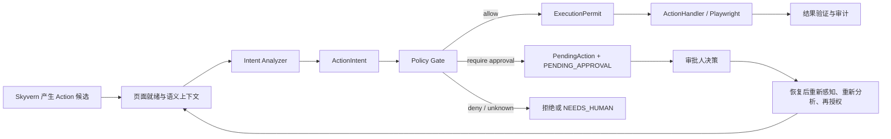

# FinRPA Phase 2 Proposal: Action Governance Bridge

## 1. 目标与非目标

### 1.1 目标

Phase 2 的目标是把 Phase 1 中已经存在、但尚未进入 Skyvern 主执行链路的企业治理能力接入**唯一的动作执行边界**。系统从“模型产生 Action 后即可执行”，升级为：

```text
页面已就绪
-> 理解动作业务意图
-> 根据任务契约与策略授权
-> 必要时暂停审批
-> 取得一次性执行许可
-> 执行、验证、审计
```

具体目标：

- 在 `ActionHandler` 执行浏览器副作用前增加不可绕过的治理闸门。
- 将技术层 `Action`（如点击、输入、下载）解释为可审计的业务层 `ActionIntent`。
- 建立 `TaskContract`、`ActionIntent`、`PolicyDecision`、`ExecutionPermit`、`PendingAction` 五类稳定契约。
- 复用 Skyvern 既有 DOM、截图和多模态 LLM 能力，形成轻量的页面就绪与语义上下文；不再使用固定 `sleep` 作为主等待策略。
- 将高风险动作转换为“持久化暂停 -> 人工审批 -> 重新感知与再授权 -> 恢复”的状态机。
- 复用既有 JWT、三维权限、风险检测、审批路由、Redis、审计与 MinIO 能力，并将其接入真实执行路径。
- 通过 `off -> audit -> enforce` 的灰度开关实现兼容迁移和快速回滚。

### 1.2 非目标

Phase 2 明确不做以下事情：

- 不重写 Skyvern 的 `Task / Step / Action / ActionHandler` 执行模型。
- 不创建第二套浏览器执行器，也不让 `enterprise.agent` 绕开 `ForgeAgent` 独立执行任务。
- 不在本阶段启用完整的通用 Planner、长期语义世界模型或多 Agent 调度；这些能力留给后续阶段消费本阶段的稳定契约。
- 不引入独立的 CV/视觉模型服务。视觉信号优先复用 Skyvern 已有截图与多模态 LLM，作为 DOM 的补充证据。
- 不改变既有业务页面、工作流模板或用户 API 的基本使用方式。
- 不将 LLM 的自由文本判断作为最终授权依据；权限、风险和审批裁决必须由确定性策略与持久化状态决定。

## 2. 现有模块和数据流

### 2.1 现有主链路

Skyvern 的实际执行核心位于 `skyvern/forge/agent.py`：

```text
用户 navigation_goal
-> ForgeAgent.execute_step(...)
-> ForgeAgent.agent_step(...)
-> ScrapedPage（截图、可交互 DOM、元素树、页面文本）
-> LLM 生成 actions JSON
-> parse_actions(...) 转为强类型 Action
-> ActionHandler.handle_action(...)
-> Playwright 浏览器副作用
-> 结果记录、目标校验、下一 Step 或完成
```

`ScrapedPage` 提供页面截图、可交互元素树、元素 ID 到 CSS/元素数据的映射。截图会作为多模态输入交给模型，因此当前系统不是纯 DOM 自动化；但页面状态、加载状态和业务语义尚未沉淀为跨模块共享的结构化对象。

`ActionHandler` 已经是统一的动作执行边界，负责动作合法性校验、具体 handler 分发、结果记录和 Playwright 交互。这是 Phase 2 的唯一执行接点。

### 2.2 企业扩展的现状

| 模块 | Phase 1 已有能力 | Phase 2 发现的边界 |
|---|---|---|
| `enterprise/auth` | JWT、部门/业务线/角色三维权限 | 当前主要用于 API 路由依赖，尚未成为动作执行前策略输入 |
| `enterprise/tenant` | 租户上下文与隔离中间件 | 不负责动作级授权 |
| `enterprise/approval` | 关键词+LLM 风险识别、审批路由、Redis Pub/Sub、审批模型 | 尚未被 `ActionHandler` 调用；审批 API 仍有内存 store 路径，不能作为生产事实来源 |
| `enterprise/audit` | 脱敏、日志、对象存储基础能力 | 尚未记录“动作候选 -> 意图 -> 策略 -> permit -> 执行”的完整证据链 |
| `enterprise/agent` | Planner、Executor、Coordinator 原型 | 尚未接入 API 或 `ForgeAgent`；不能在 Phase 2 作为第二执行循环启用 |
| `enterprise/llm` | 容错、缓存、模型路由 | 可继续被意图分析复用，但不承担最终策略裁决 |

### 2.3 当前差距

当前主链路的校验重点是“该 Action 是否引用了当前页面存在的元素”，而不是“此操作在业务上是否允许执行”。例如 `click(element_42)` 可能代表下一步、下载客户流水、确认付款或批准放款；技术动作类型本身不足以承担风险、权限、审批和审计语义。

当前审批模块即使可创建审批单，也没有一个强制的执行前接点阻止动作绕过审批。Phase 2 的核心就是关闭这个缺口。

## 3. 推荐架构及关键接口

### 3.1 推荐架构

推荐采用一个 Action Governance Bridge，而不是多个并列执行方案：



集成点固定为：

```text
parse_actions(...)
-> ActionGovernor.authorize(...)
-> ActionHandler.handle_action(..., permit)
```

`ActionHandler` 在其公共入口验证并消费 permit；没有 permit 或 permit 与当前动作/页面不匹配时，任何高影响动作都不得落入 Playwright。这样策略层不会因绕过某个上层路由而失效。

### 3.2 页面就绪与语义上下文

页面感知以 DOM 为主、视觉为补充。等待不再以固定秒数表达，而是根据可验证条件判断页面是否可操作。

```python
class PageReadiness(str, Enum):
    LOADING = "loading"
    READY = "ready"
    TRANSITIONING = "transitioning"
    BLOCKED = "blocked"
    UNKNOWN = "unknown"


class ObservationContext(BaseModel):
    observation_id: str
    task_id: str
    step_id: str
    page_url: str
    page_title: str | None
    snapshot_hash: str
    screenshot_artifact_id: str | None
    page_type: str | None
    semantic_summary: str
    readiness: PageReadiness
    readiness_confidence: float
    dom_signals: dict
    visual_signals: dict
    target_evidence: dict
    captured_at: datetime
```

就绪判断优先使用确定性信号：页面 `readyState`、目标元素可见/可用、DOM 增量稳定、遮罩或 spinner 消失、URL/页面状态变化。DOM 信号不足或与截图冲突时，才使用现有多模态能力进行视觉复核，例如 canvas、PDF、骨架屏、验证码、覆盖层和虚拟表格。

对 `BLOCKED` 或 `UNKNOWN` 状态，禁止执行可能造成外部副作用的动作。

### 3.3 五个核心契约

#### TaskContract

`TaskContract` 是用户任务的业务与安全边界，在任务创建时生成或从兼容输入派生。

```python
class TaskContract(BaseModel):
    contract_id: str
    task_id: str
    organization_id: str
    principal_id: str
    department_id: str | None
    business_line_id: str | None
    goal: str
    allowed_operations: set[str]
    data_scope: dict
    policy_profile: str
    success_criteria: list[str]
    expires_at: datetime | None
    version: int
```

它不是替代现有 `Task.navigation_goal`，而是为同一任务增加“允许做什么、代表谁做、可访问什么范围、如何证明完成”的可审计约束。

#### ActionIntent

`ActionIntent` 将 `Action` 的技术表达转为业务可治理的语义表达。

```python
class ActionIntent(BaseModel):
    intent_id: str
    task_id: str
    step_id: str
    action_fingerprint: str
    observation_id: str
    operation: str
    effect: Literal["none", "read", "internal_write", "external_write"]
    target: dict
    sensitive_data_types: set[str]
    extracted_facts: dict
    confidence: float
    evidence: list[str]
    expected_outcome: dict
```

`operation` 采用有限且可扩展的分类，例如 `navigate`、`read`、`input`、`download`、`submit`、`approve`、`payment`、`delete`。它不是风险等级。风险由 `operation + effect + target + extracted_facts + TaskContract + UserContext` 共同推导。

#### PolicyDecision

```python
class PolicyDecision(BaseModel):
    decision_id: str
    intent_id: str
    outcome: Literal["allow", "require_approval", "deny", "needs_human"]
    risk_level: Literal["low", "medium", "high", "critical", "unknown"]
    reasons: list[str]
    matched_rules: list[str]
    required_approver: dict | None
    policy_version: str
```

策略必须数据化、可版本化。LLM 可以帮助分析意图和补充上下文，但不能独自决定 `allow`。每个策略决策必须记录命中的规则和策略版本。

#### ExecutionPermit

```python
class ExecutionPermit(BaseModel):
    permit_id: str
    task_id: str
    step_id: str
    action_fingerprint: str
    observation_id: str
    policy_decision_id: str
    issued_at: datetime
    expires_at: datetime
    used_at: datetime | None
```

permit 是短时、一次性、与动作指纹和页面快照绑定的执行许可。`action_fingerprint` 至少绑定任务、步骤、动作类型、目标元素、脱敏参数和 `snapshot_hash`。它防止审批后页面变化、动作被替换或恢复任务重复提交。

#### PendingAction

```python
class PendingAction(BaseModel):
    pending_action_id: str
    task_id: str
    step_id: str
    action_payload: dict
    intent: ActionIntent
    decision: PolicyDecision
    approval_id: str
    status: Literal["pending", "approved", "rejected", "expired", "invalidated"]
    created_at: datetime
    resume_requirements: dict
```

`PendingAction` 用于审批而不是让浏览器协程长时间阻塞等待 Redis。审批通过后不重放旧 Action；任务恢复时必须重新抓取页面、重建 `ObservationContext`、重建 `ActionIntent`、比对金额/对象/目标/页面版本，并重新签发 permit。

### 3.4 服务边界

```python
class IntentAnalyzer(Protocol):
    async def analyze(
        self,
        action: Action,
        observation: ObservationContext,
        task_contract: TaskContract,
    ) -> ActionIntent: ...


class PolicyGate(Protocol):
    async def decide(
        self,
        intent: ActionIntent,
        task_contract: TaskContract,
        user: UserContext,
    ) -> PolicyDecision: ...


class PermitService(Protocol):
    async def issue(
        self,
        action: Action,
        intent: ActionIntent,
        decision: PolicyDecision,
    ) -> ExecutionPermit: ...

    async def verify_and_consume(
        self,
        permit: ExecutionPermit,
        action: Action,
        observation: ObservationContext,
    ) -> None: ...


class ActionGovernor(Protocol):
    async def authorize(
        self,
        action: Action,
        scraped_page: ScrapedPage,
        task: Task,
        step: Step,
        user: UserContext,
    ) -> ExecutionPermit | PendingAction | PolicyDecision: ...
```

### 3.5 不可违反的架构原则

1. 没有有效 permit，不执行任何外部副作用 Action。
2. 对会改变外部状态、但业务意图无法高置信度识别的动作，默认 `NEEDS_HUMAN`。
3. 审批通过后必须重新感知与再授权，绝不直接重放旧动作。
4. 同一个 Task 同一时间只能拥有一个有效的高影响 PendingAction 和一个可消费 permit。
5. 任何传给 LLM、写入日志或计算指纹的敏感输入都必须先经过统一脱敏；原始证据仅按最小权限保存于内网对象存储。

## 4. 迁移/兼容策略

### 4.1 保持原有协议

Phase 2 以附加层方式扩展，保留现有 API、`Task`、`Step`、`Action`、工作流模板和 `ActionHandler` 语义。新数据模型采用新增表/字段；不做破坏性迁移，也不修改历史动作记录的含义。

对于尚未带 `TaskContract` 的历史或兼容任务，运行时派生受限的兼容契约，并完整记录该来源。兼容契约只允许低风险 `navigate`/`read` 等默认操作；状态变更类动作在 enforce 模式下仍必须经过策略裁决。

### 4.2 三阶段开关

按环境、机构、业务线或工作流支持如下开关：

| 模式 | 行为 | 用途 |
|---|---|---|
| `off` | 完全保持 Phase 1 执行行为 | 紧急兼容与回滚 |
| `audit` | 生成上下文、意图和策略决策并写审计，但不阻断执行 | 收集误报、完善规则、回放验证 |
| `enforce` | 没有 permit 不执行；高风险走审批暂停恢复 | 生产受控运行 |

先在 `audit` 模式验证真实工作流，再按机构/工作流逐步进入 `enforce`。开关必须可动态回退到 `audit` 或 `off`，但已经创建的审批与审计记录不删除。

### 4.3 审批事实来源统一

审批 API 当前的内存 store 只适用于测试。Phase 2 将审批列表、审批决策、等待/恢复都统一到数据库中的审批记录；Redis 仅作为通知与唤醒通道，不能作为审批最终事实来源。审批决定必须幂等，避免双击、重复消息或多个 worker 导致重复恢复。

### 4.4 恢复与幂等

对于 `submit`、`payment`、`approve`、`delete` 等副作用操作，恢复前必须检查是否已经生效。每个高影响动作需要可审计的幂等键或业务结果探测，网络超时和服务重启不能导致盲目重复提交。

## 5. 分阶段任务拆分

### Phase 2.0：契约与审计基线

- 定义五个核心契约、枚举、动作指纹和策略版本模型。
- 定义 `ObservationContext` 与 `PageReadiness`，复用现有 `ScrapedPage`。
- 扩展审计事件，记录候选 Action、脱敏意图、策略决策和证据引用。
- 增加 `off/audit/enforce` 配置和按机构/工作流灰度能力。
- 默认仅运行 `audit`，不得改变现有执行结果。

### Phase 2.1：意图分析与策略闸门

- 实现 `IntentAnalyzer`：先使用 DOM、页面文本、元素标签、截图证据和任务契约，必要时再调用多模态 LLM。
- 实现 `PolicyGate`：复用现有三维权限、风险检测、审批路由；将 `operation/effect/facts` 纳入规则输入。
- 在 `parse_actions` 之后、`ActionHandler` 之前接入 `ActionGovernor`。
- 初始覆盖 `navigate`、`read`、`input`、`download`、`submit` 五类意图。
- 对 `BLOCKED`/`UNKNOWN` 页面和不确定的外部写动作执行 fail-safe 策略。

### Phase 2.2：执行许可强制化

- 实现短时、一次性 `ExecutionPermit` 的签发、校验和消费。
- 在 `ActionHandler` 公共入口强制验证 permit，防止任何调用路径绕过治理层。
- 建立动作指纹与页面快照版本校验。
- 为高影响动作增加幂等检查与执行后结果验证。

### Phase 2.3：审批暂停与安全恢复

- 持久化 `PendingAction` 并将任务转入 `PENDING_APPROVAL`。
- 统一审批 API 与数据库存储，Redis 仅用于通知。
- 实现批准、拒绝、超时、撤销和服务重启后的恢复流程。
- 恢复后重新感知、重新分析并重新授权；页面或业务事实变化时失效并转人工或重新审批。

### Phase 2.4：灰度、验收与运营

- 在代表性金融工作流中运行 `audit`，收集意图置信度、策略误报、人工接管率和审批时延。
- 按机构/工作流逐步打开 `enforce`。
- 建立治理看板：无 permit 拦截数、审批等待时长、恢复失败率、重复提交阻断数、策略版本分布。
- 输出 Phase 3 输入：经过验证的意图分类、页面语义、任务契约和恢复事件，为动态 Planner 做准备。

## 6. 风险、测试与回滚方案

### 6.1 主要风险与缓解措施

| 风险 | 影响 | 缓解措施 |
|---|---|---|
| 意图误判导致误拦截 | 用户体验与任务成功率下降 | 先 audit 灰度；规则优先；保留 `needs_human`；记录证据并回放 |
| 意图漏判导致高风险动作放行 | 金融合规风险 | 外部写操作默认严格；低置信度/未知状态 fail-safe；permit 强制校验 |
| 审批等待期间页面变化 | 批准后执行错误对象或金额 | 不重放旧动作；恢复后重新感知、重新分析、再签发 permit |
| Redis 或 worker 中断 | 审批/任务状态丢失或重复恢复 | 数据库为事实来源；Redis 仅通知；审批、permit、PendingAction 幂等化 |
| 截图/DOM 含敏感数据 | 数据泄露 | 统一 sanitizer；最小化 LLM 上下文；内网对象存储、短时访问、审计访问 |
| 性能与 LLM 成本增加 | 延迟和成本上升 | DOM/规则优先；仅在冲突、未知或高风险时视觉复核；缓存脱敏语义摘要 |
| 多个 worker 同时恢复 | 重复执行副作用 | Task/PendingAction 加锁；一个有效 permit；一次性消费语义 |

### 6.2 测试策略

#### 单元测试

- `TaskContract`、`ActionIntent`、动作指纹、permit 过期/一次性消费。
- 意图分类：同一 `click` 在不同页面语义下得到不同业务意图。
- 策略规则：权限、部门隔离、金额阈值、职责分离、未知风险 fail-safe。
- 页面就绪：loading、overlay、DOM 稳定、视觉/DOM 冲突、captcha/blocked。
- 审批状态机：批准、拒绝、超时、撤销、重复消息、恢复失效。

#### 集成测试

- 没有 permit 的 `submit/payment/delete` 动作必须被 `ActionHandler` 拒绝。
- 低风险读取动作在 enforce 模式下正常执行并记录裁决。
- 高风险动作创建数据库审批单，审批人仅能看到授权范围内的待办。
- 审批后页面金额、对象、元素或快照变化时，旧动作不得执行。
- Redis/worker 重启后，任务与审批状态可从数据库恢复。

#### 端到端与回归测试

- 登录 -> 查询 -> 导出、表单填写 -> 提交、以及高风险确认三类完整工作流。
- `off` 模式下既有 Skyvern 工作流行为与 Phase 1 回归基线一致。
- `audit` 模式下执行结果不变，但审计事件完整。
- `enforce` 模式下所有外部写动作都有可追溯 permit 和策略决策。

### 6.3 验收标准

- 在 enforce 模式下，不存在绕过 permit 的外部副作用执行路径。
- 高风险动作的审批、恢复、再验证、审计链路可端到端演示。
- 审批通过后页面变化场景被可靠阻断，且不会重放旧动作。
- off/audit/enforce 三种模式可按机构或工作流切换。
- 现有核心工作流和 Phase 1 测试在 `off` 模式下保持兼容。
- 全部敏感字段在意图分析日志、策略日志和动作指纹中保持脱敏。

### 6.4 回滚方案

- 首选回滚：将相关机构/工作流从 `enforce` 切回 `audit`，保留观测，不阻断既有执行。
- 紧急回滚：切换到 `off`，恢复 Phase 1 动作链路。
- 数据库迁移只新增、不删除、不重命名现有核心字段；回滚无需破坏历史 `Task / Step / Action` 数据。
- 已创建的审批单与审计证据保留，只停止对后续新动作进行强制闸门。

## 后续阶段接口

Phase 3 可在不改变执行器的前提下，引入 Planner 和更完整的语义世界模型：Planner 读取 `TaskContract`、`ObservationContext`、`ActionIntent` 和执行结果，生成或重规划业务子任务；底层仍通过 Phase 2 的 `ActionGovernor` 和 `ExecutionPermit` 进入执行器。这样“更聪明的规划”不会削弱已建立的金融治理边界。

## Final implementation decisions

The architecture review below is accepted in full and is part of this proposal. Where a reviewed alternative requires a choice, this proposal selects **native Skyvern state-machine extension**: extend `TaskStatus` and `StepStatus` with `PENDING_APPROVAL`, including database constraints, workflow mapping, and recovery scheduling. Do not introduce a parallel `GovernanceRun` state owner.

The following review items are mandatory gates before enforce: complete execution-entry sealing, one-state-changing-action-per-observation semantics, persisted `ExecutionAttempt` with `UNKNOWN` recovery, persistent identity/authorization snapshots, typed commit-boundary facts, data-classification/model-egress controls, database-backed concurrent approvals, and explicit Alembic migrations.
# Phase 2 Architecture Review: Action Governance Bridge

## ??

**???????**

???????????? Agent Harness?Skyvern ????????????????????????????????? Action?`TaskContract -> ActionIntent -> PolicyDecision -> ExecutionPermit -> PendingAction` ????????????????????????? permit??????????

??????????? `enforce` ???????? Skyvern ????/??????????????????????????????? permit ???????????????????????????????????????????? Phase 2.0/2.1?Phase 2.2 ? 2.3 ???????

## ????????

### ????

1. **`PENDING_APPROVAL` ???? Skyvern ???????????**
   ???????? `PENDING_APPROVAL`???? `TaskStatus` ?? `created/queued/running` ???????????????????? `running` ????[tasks.py](E:/meizhouyu/agentstudy/_tmp_finrpa_enterprise/skyvern/forge/sdk/schemas/tasks.py:186)?????????????????? block ? completed/failed/canceled ??????????????????
   - ?? Skyvern `TaskStatus`???? enum/???workflow block ???????????????????
   - ?? Skyvern Task ?????????????? `GovernanceRun`/`PendingAction` ????????????????? step?

   ????? `PendingAction` ???? Task ?? `running`?worker ???????????????????????

2. **?? `ActionHandler` ????? permit????????????**
   ??????? `ActionHandler.handle_action()` ???[agent.py](E:/meizhouyu/agentstudy/_tmp_finrpa_enterprise/skyvern/forge/agent.py:1378)?[handler.py](E:/meizhouyu/agentstudy/_tmp_finrpa_enterprise/skyvern/webeye/actions/handler.py:391)????????????? `handle_click_action`?`handle_input_text_action` ??? handler????? locator fallback?[real_skyvern_page_ai.py](E:/meizhouyu/agentstudy/_tmp_finrpa_enterprise/skyvern/core/script_generations/real_skyvern_page_ai.py:204)??

   ??????????????????????????????????????????? Governor????? handler ?????????????????????? permit ??????????????????

3. **? Action ??????? permit ???????**
   `agent_step` ??? `ScrapedPage` ???? actions ??????[agent.py](E:/meizhouyu/agentstudy/_tmp_finrpa_enterprise/skyvern/forge/agent.py:1179)?[agent.py](E:/meizhouyu/agentstudy/_tmp_finrpa_enterprise/skyvern/forge/agent.py:1242)??????? permit ?? `snapshot_hash`??????? DOM ? action ?????? action ??????????

   ??????????????????????? action??????????????????????????????????? observation????????? auto-complete??????????????? CUA ?????

4. **permit ?????????????????????**
   `used_at` ???? permit ??????????????? click ???????????????? click??????????????????

   ?????????????????`AUTHORIZED -> EXECUTING -> CONFIRMED | UNKNOWN | FAILED`???? Playwright ???? `EXECUTING` ????????????????`UNKNOWN` ?????????????????????????????????????????????????????

5. **TaskContract ???????????????????**
   ?? `TenantContext` ???? `ContextVar`??????????[context.py](E:/meizhouyu/agentstudy/_tmp_finrpa_enterprise/enterprise/tenant/context.py:13)???? task????? worker ?????? `UserContext`?? `TaskExtensionModel` ????????????? `created_by`???????????[models.py](E:/meizhouyu/agentstudy/_tmp_finrpa_enterprise/enterprise/auth/models.py:234)?

   ???? native Task?workflow Task??? Task ??????????? TaskContract???? initiator??????????????????????????????????????????????????????????????????/???????

6. **???????????????????????**
   `ActionIntent.target`?`extracted_facts`?`expected_outcome` ????? `dict`??? `payment/submit/approve/delete`???????? canonical fields??????? ID????????/??????????????????? commit preconditions???? CUA action ?? element id?????????????????/???????????????????????? commit boundary?

7. **????????????????**
   ?????????? `hash_raw_value()` ????? SHA-256?[sanitizer.py](E:/meizhouyu/agentstudy/_tmp_finrpa_enterprise/enterprise/audit/sanitizer.py:116)???????????????????????????????? Skyvern ?? DOM ????????????????????????????????????????????????????????

   ??????? data classification???/?? allowlist???/DOM ????HMAC fingerprint???????????????????????????????????? LLM ????????

8. **?????????????????????**
   ?? `ApprovalRequestModel` ?? requester/principal??? intent/permit?????????[models.py](E:/meizhouyu/agentstudy/_tmp_finrpa_enterprise/enterprise/approval/models.py:48)???? API ?????? CAS ????????????????contract/intent/pending-action ???`row_version` ???????????????????????????????????????????

9. **?? schema ????????/??/????**
   ?? enterprise migration ??????? `task_extensions` ??Phase 2 ??? approval?audit?contract?permit?pending-action?execution-attempt ????? Alembic migration????????????????????? `ensure_enterprise_schema.py` ???? demo store?

### ????

1. ??????? `sleep` ?????????????????? ActionHandler ?????????????????Phase 2 ??? `PageReadiness` ?????????????????????????????

2. `input`?`download`?`navigate` ??? action type ?????????????????????????????????????????????? effect????????????????????????????

3. `CompleteAction` ????????????????????????[handler.py](E:/meizhouyu/agentstudy/_tmp_finrpa_enterprise/skyvern/webeye/actions/handler.py:2139)??TaskContract ?????????????????????????????????????????

4. `off/audit/enforce` ????????audit ?????????policy/permit ?????? enforce ?? fail-closed?????????????????? task/contract ?????????????????????

5. ???? CUA?UI-TARS?????????????/????? step ? action???????????????????????????????

### ?????

1. Phase 2 ??? Planner?? Agent ????????????????? Agent ????????????????????????

2. ?? DOM ??????????????????????????????????????? fail-safe ???????

3. ?? `audit` ?????????????/??????? `enforce` ???????????? audit ???????? action?contract???????????

## ???????????????

?????? [create_approval_and_wait](E:/meizhouyu/agentstudy/_tmp_finrpa_enterprise/enterprise/approval/pubsub.py:178) ???????????????? Redis ???????????????? `PendingAction + ????? + ?????` ???????

| ?? | ???? | ????? |
|---|---|---|
| ?? + Redis Pub/Sub ???? | ???? worker????????????? OTP ?????????????????????????????? | ?????????????? worker?????????????????????????????????????? |
| `PendingAction` ?????????? | ??????????????/???????????????? worker ??????????????? | ??????????????????????????????????????????? |

???????????????????????????????????????????Redis ??????

## ??????????

???? `parse_actions -> ActionGovernor.authorize -> ActionHandler.handle_action(permit)` ??????????????????????

- ?? Governor ?????????????? allow/approval/deny ???
- ?? ActionHandler ???? permit ???????????

??????????????? handler ? locator ??????????????????????????????????

## ?????????

- ???????? permit ????`EXECUTING` ??????? click ??????????? worker???????????????
- ??????????????? worker????????????????????
- ?????JWT ???????/?????????????????????????????
- ????????DOM?prompt?????????????????????OTP?????????????/?????
- ???????? LLM ??????????? DOM ????? permit ???? observation ???????????

## ????

**???????**

???? Action Governance Bridge ?? Phase 2 ???????????? Phase 2.0 ????schema?????? audit-only ???????????????????????????????? UNKNOWN ??????????/???????????????????? `enforce`????????????????

